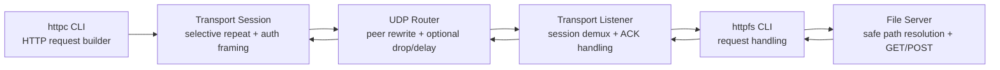
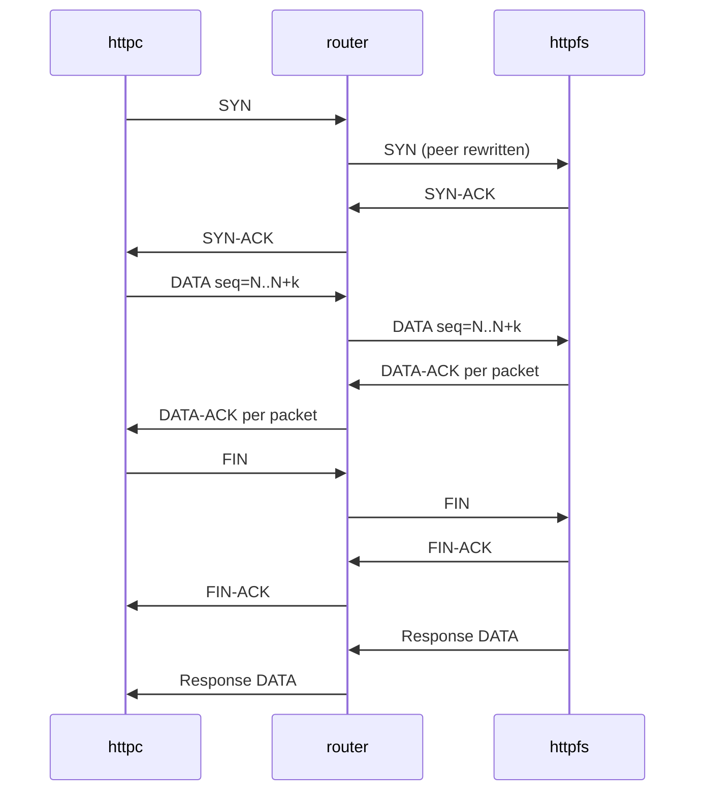

# Selective Repeat HTTP Over UDP

Reliable HTTP-style file transfer over UDP, built in Go with a selective-repeat transport, a relay router, and a file server that survives loss, reordering, and retries.

## Why this project matters

This project turns an unreliable datagram network into a request-response system that behaves much more like a small transport stack than a toy socket demo.

What makes it technically hard:

- UDP gives no ordering, retransmission, flow control, or connection lifecycle for free.
- The transport has to recover from dropped, duplicated, delayed, and out-of-order packets.
- Request-response semantics have to be rebuilt on top of a message-oriented protocol.
- Reliability features cannot break router compatibility or make the wire format too large.

## At a glance

- Selective-repeat sliding window with adaptive retransmission timeout updates.
- Session-aware authenticated framing for control and data packets.
- Multi-session concurrent file serving over HTTP/1.0 semantics.
- Metrics, transport logging, retries, and end-to-end integration coverage.
- Go-native router, client, and server so the whole demo runs from one repo.

**Stack**

- Go 1.21+
- UDP + IPv4
- HTTP/1.0 request and response framing
- Selective-repeat reliability layer
- PowerShell and Go integration test tooling

## Architecture



## Demo flow

1. Start the router.
2. Start the file server against `examples/data`.
3. Send a `GET` or `POST` with `httpc` and watch the transport recover reliably over UDP.

```powershell
go build -o .\bin\router.exe .\cmd\router
go build -o .\bin\httpfs.exe .\cmd\httpfs
go build -o .\bin\httpc.exe .\cmd\httpc
.\bin\router.exe --port 3000 --drop-rate 0 --max-delay 0ms --seed 1
.\bin\httpfs.exe -p 8007 -d .\examples\data
.\bin\httpc.exe get --router-host localhost --router-port 3000 http://localhost:8007/sample.txt
```

## How it works

The client serializes an HTTP/1.0 request, segments it into UDP packets, and sends those packets through a relay router using a selective-repeat window. Each packet carries a sequence number and authenticated payload frame. The server reassembles the request, processes it as a file operation, then sends the HTTP response back over the same transport.

The reliability layer explicitly manages `SYN`, `DATA`, and `FIN` control flow, retransmits timed-out packets, acknowledges data independently, and updates its retransmission timeout from measured RTT samples.

## Request flow



## Features

- `Metrics`: packet counts, ACK counts, bytes, retransmissions, RTT samples, and current RTO.
- `Structured-ish transport logs`: session-open, session-close, retransmission, and timeout events with peer context.
- `Retries`: adaptive RTO plus per-packet retransmission for data and control flow.
- `Auth`: session-bound authenticated payload framing to reject cross-session or corrupted packets.
- `Integration tests`: Go-native end-to-end coverage plus scripted router/file-transfer verification.

## Repo layout

```text
.
|-- cmd
|   |-- httpc          # UDP HTTP client CLI
|   |-- httpfs         # UDP file server CLI
|   `-- router         # Cross-platform UDP router CLI
|-- examples
|   `-- data           # Demo payloads and sample files
|-- integration        # Go-native end-to-end tests
|-- internal
|   |-- fileserver     # File operations and path safety
|   |-- httpwire       # HTTP/1.0 parsing and rendering
|   |-- protocol       # Packet encoding and decoding
|   |-- router         # Relay implementation
|   `-- transport      # Sessions, framing, RTO, metrics
|-- scripts            # PowerShell test runners
|-- .env.example       # Local command defaults
`-- Makefile           # Common build/run/test targets
```

## Quick start

### Prerequisites

- Go 1.21.4 or newer
- IPv4 networking
- A terminal that can run Go commands

### Local config

Optional local defaults live in `.env.example`. Copy it to `.env` if you want to override ports, timeouts, or data paths for local runs.

### Build

```powershell
go build -o .\bin\httpc.exe .\cmd\httpc
go build -o .\bin\httpfs.exe .\cmd\httpfs
go build -o .\bin\router.exe .\cmd\router
```

### Run

Start the router:

```powershell
.\bin\router.exe --port 3000 --drop-rate 0 --max-delay 0ms --seed 1
```

Start the server:

```powershell
.\bin\httpfs.exe -v -p 8007 -d .\examples\data --metrics-interval 5s
```

Run a GET:

```powershell
.\bin\httpc.exe get --router-host localhost --router-port 3000 http://localhost:8007/sample.txt
```

Run a POST:

```powershell
.\bin\httpc.exe post --router-host localhost --router-port 3000 -f .\examples\data\upload.txt http://localhost:8007/uploads/posted.txt
```

## Make targets

The repo also includes simple targets for common workflows:

```text
make build
make test
make test-e2e
make run-router
make run-server
make demo-get
make demo-post
```

## Testing

Run the full Go suite:

```powershell
go test -buildvcs=false ./...
```

Run the scripted verification flow:

```powershell
.\scripts\Test-All.ps1
```

The scripted suite covers:

- small-file `GET`
- small-file `POST` round-trip
- large binary `GET`
- large binary `POST` round-trip
- large text `GET`
- large text `POST` round-trip
- concurrent binary downloads with SHA-256 verification
- concurrent text downloads with SHA-256 verification

## Design decisions

- `Selective repeat over stop-and-wait`: better throughput once payloads span multiple packets.
- `Authenticated payload framing instead of header changes`: keeps router compatibility while still protecting control and data messages.
- `Go router in-repo`: improves portability and makes end-to-end testing independent from a single Windows binary.
- `HTTP/1.0 over UDP`: gives a familiar application protocol while keeping the transport behavior explicit and inspectable.

## Failure handling

- Out-of-order packets are buffered within the receive window.
- Lost packets are retransmitted when the adaptive RTO expires.
- Duplicate packets are acknowledged again but not re-applied.
- Corrupted or unauthenticated frames are dropped.
- Traversal attempts are rejected before file operations escape the data root.
- Oversized logical messages are rejected to cap in-memory assembly.

## Key tradeoffs

- `Router compatibility vs stronger header auth`: the router rewrites peer metadata, so authentication lives in the payload frame instead of the mutable header.
- `Simplicity vs full transport semantics`: this is reliable request-response messaging, not a full TCP replacement.
- `Project clarity vs production breadth`: the system favors observable transport behavior over advanced features like congestion control or multiplexed streams.

## Important design choices

- The wire format is small and explicit so packet behavior is easy to inspect and test.
- Sessions use explicit lifecycle packets (`SYN`, `DATA`, `FIN`) instead of implicit socket state.
- Metrics and logs are first-class because transport work is hard to debug without visibility.
- The examples folder doubles as demo data so new contributors can run the repo quickly.

## Limitations

- IPv4 only: packet headers store four-byte IP addresses.
- No congestion control beyond the selective-repeat window.
- No persistent HTTP connection reuse or streaming bodies.
- Local configuration is documented through `.env.example` and `Makefile`, not loaded automatically by the binaries.
- Graceful shutdown for the file server can still be improved further.

## Future improvements

- Add true structured JSON logging and OpenTelemetry tracing hooks.
- Introduce graceful shutdown coordination for the server listener and active sessions.
- Support configurable persistence or pluggable storage backends beyond the local filesystem.
- Add rate limiting, stronger auth rotation, and optional TLS-style tunnel protection at the edge.
- Extend portability tooling with shell scripts or containerized demo targets for non-PowerShell environments.

## What this would look like at scale

- Replace the single relay router with a managed edge or service mesh-aware gateway.
- Add service discovery and external configuration instead of localhost defaults.
- Export metrics to Prometheus-compatible backends and traces to a distributed collector.
- Split request handling from file storage using an object store or replicated data service.
- Introduce stronger operational controls around backpressure, quotas, and rolling deploys.
